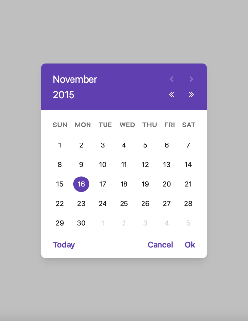
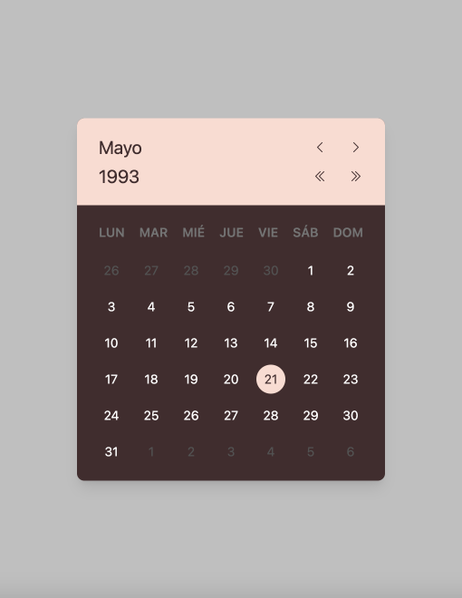
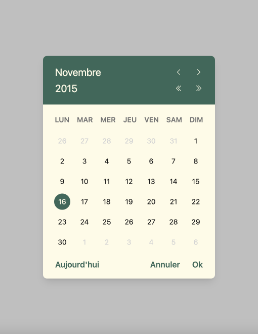
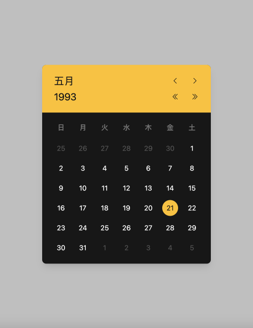

[](https://github.com/dmnchzl/minimalgooglemapreact) [](https://www.npmjs.com/package/@dmnchzl/datepicker) [](https://wikipedia.org/wiki/beerware)

# DatePicker

**@dmnchzl/datepicker** is an accessible and customizable `<DatePicker />` component built with **[React](https://reactjs.org)** and other cool stuff (like [styled-components](https://github.com/styled-components/styled-components) or [polished](https://github.com/styled-components/polished))

## Props

Below, the list of all available props:

**color** / **bgColor**

> Colorize the text / the background of the component

By default, the component colors are respectively purple (`#673ab8`) and white (`#fff`) for the background

```jsx
import { DatePicker } from '@dmnchzl/awesome-hooks';

export default function App() {
  return (
    <div>
      <DatePicker color="#ffc107" bgColor="#171717">
        {props => (
          <input
            ref={props.ref}
            type="date"
            onClick={e => {
              e.preventDefault();
              props.onOpen();
            }}
          />
        )}
      </DatePicker>
    </div>
  );
}
```

**dayOfTheWeek**

> Change the start day of the week

Sunday (`0`) is the default week start day, but French people prefer to start the week on Monday (`1`)

```jsx
import { DatePicker } from '@dmnchzl/awesome-hooks';

export default function App() {
  return (
    <div>
      <DatePicker dayOfTheWeek={1}>
        {props => (
          <input
            ref={props.ref}
            type="date"
            onClick={e => {
              e.preventDefault();
              props.onOpen();
            }}
          />
        )}
      </DatePicker>
    </div>
  );
}
```

**forceLocale**

> Force the locale / the language

By default, the component is based on the navigator's language, but you can force the locale to have several different `<DatePicker />` on the same view

_**NB**: Currently, the component supports the following locales: `de` / `en` / `es` / `fr` / `it` / `ja` ; for further, take a look at the `customMessages` prop below..._

```jsx
import { DatePicker } from '@dmnchzl/awesome-hooks';

export default function App() {
  return (
    <div>
      <DatePicker forceLocale="ja">
        {props => (
          <input
            ref={props.ref}
            type="date"
            onClick={e => {
              e.preventDefault();
              props.onOpen();
            }}
          />
        )}
      </DatePicker>
    </div>
  );
}
```

**hideFooter**

> Hide component footer (and its buttons)

When the footer is hidden, the calendar disappears when a date is selected / or when the escape button is pressed

```jsx
import { DatePicker } from '@dmnchzl/awesome-hooks';

export default function App() {
  return (
    <div>
      <DatePicker hideFooter>
        {props => (
          <input
            ref={props.ref}
            type="date"
            onClick={e => {
              e.preventDefault();
              props.onOpen();
            }}
          />
        )}
      </DatePicker>
    </div>
  );
}
```

**customMessages**

> (Re)translate all or part of the component

```jsx
import { DatePicker } from '@dmnchzl/awesome-hooks';

export default function App() {
  return (
    <div>
      <DatePicker customMessages={{ 'Footer.Cancel': 'Nope', 'Footer.Ok': 'Okay' }}>
        {props => (
          <input
            ref={props.ref}
            type="date"
            onClick={e => {
              e.preventDefault();
              props.onOpen();
            }}
          />
        )}
      </DatePicker>
    </div>
  );
}
```

| Month Keys        | Days Key        | Footer Keys     |
| ----------------- | --------------- | --------------- |
| `Month.January`   | `Day.Sunday`    | `Footer.Today`  |
| `Month.February`  | `Day.Monday`    | `Footer.Cancel` |
| `Month.March`     | `Day.Tuesday`   | `Footer.Ok`     |
| `Month.April`     | `Day.Wednesday` |                 |
| `Month.March`     | `Day.Thursday`  |                 |
| `Month.May`       | `Day.Friday`    |                 |
| `Month.June`      | `Day.Saturday`  |                 |
| `Month.July`      |                 |                 |
| `Month.August`    |                 |                 |
| `Month.September` |                 |                 |
| `Month.October`   |                 |                 |
| `Month.November`  |                 |                 |
| `Month.December`  |                 |                 |

## Preview

> https://raw.githubusercontent.com/DmnChzl/DatePicker/main






## Project Structure

```
/
├── src/
│   ├── components/
│   │   ├── __tests__/
│   │   │   └── DatePicker.test.tsx
│   │   ├── icons/
│   │   │   ├── ChevronLeft.tsx
│   │   │   ├── ChevronRight.tsx
│   │   │   ├── DoubleChevronLeft.tsx
│   │   │   ├── DoubleChevronRight.tsx
│   │   │   └── index.ts
│   │   ├── DatePicker.tsx
│   │   └── styled.ts
│   ├── constants/
│   │   └── index.ts
│   └── utils/
│       ├── __tests__/
│       │   ├── arrUtils.test.ts
│       │   └── dateUtils.test.ts
│       ├── arrUtils.ts
│       └── dateUtils.ts
├── package.json
└── vite.config.ts
```

## Miscellaneous

If you want more,

You can clone the project:

```
git clone https://github.com/dmnchzl/datepicker.git
```

Install dependencies:

```
yarn install
```

Develop locally:

```
yarn dev
```

Run all unit tests:

```
yarn test
```

If you want, format the code:

```
yarn format
```

And finally compile the project:

```
yarn build
```

Enjoy 👍

## License

```
"THE BEER-WARE LICENSE" (Revision 42):
<phk@FreeBSD.ORG> wrote this file. As long as you retain this notice you
can do whatever you want with this stuff. If we meet some day, and you think
this stuff is worth it, you can buy me a beer in return. Damien Chazoule
```
